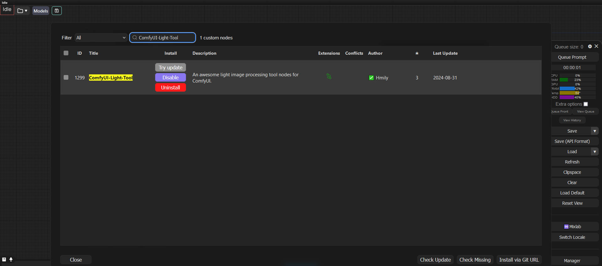
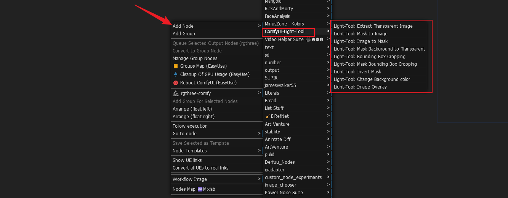
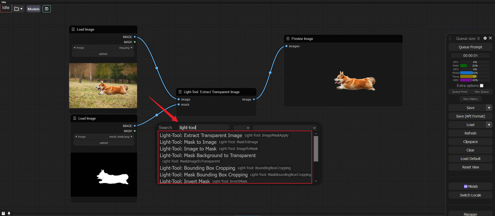
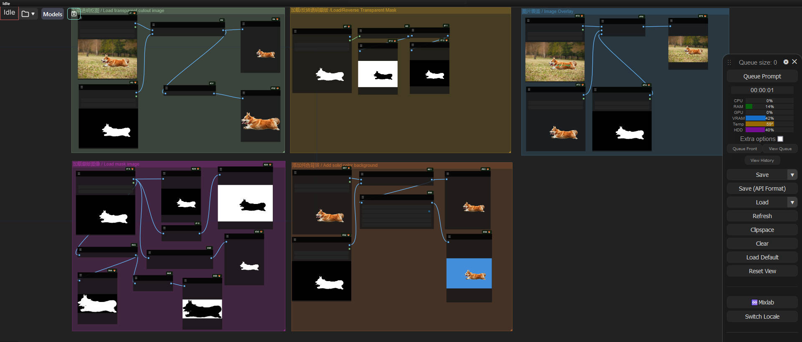

# ComfyUI-Light-Tool
[](https://registry.comfy.org/nodes/comfyui-light-tool)

An awesome  light tool  node for ComfyUI. 

This node offers the following image processing capabilities:

- **Load Image**: Load image with alpha、Load image from url、Load image from image directory.
- **Load Video**: Load and preview video from video url or video path.
- **Save To OSS**: upload image and video to aliyun oss.
- **Bounding Box Cropping**: Crop a specific area of an image based on the defined bounding box.

- **Foreground Image Separation Using Mask**: Isolate the foreground image from the original image.
- **Load Transparent Image with Cutout**: Load an image that has already been cut out (segmented) with a transparent background.
- **Load Mask**: Import a mask file for image processing.
- **Invert Mask**: Invert the colors of the mask to meet different image processing requirements.
- **Add Solid Color Background**: Add a background of a single color to the image.
- **Image Overlay**: Superimpose multiple images according to certain rules.
- **more ...**


# Installation

Make sure you have installed [ComfyUI](https://github.com/comfyanonymous/ComfyUI)

```
cd custom_nodes
git clone https://github.com/ihmily/ComfyUI-Light-Tool.git
pip install -r requirements.txt
```

or use ComfyUI-Manager install.



After installation, restart ComfyUI to use this node. 

Here is version 1.0.0




# Usage

**Example:**





[workflow_demo](./demo/workflow_demo.json)
