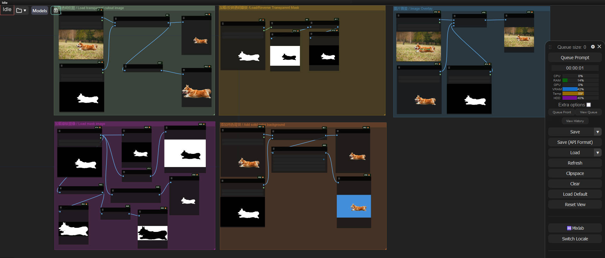

# ComfyUI-Light-Tool
An awesome  image processing tool  node for ComfyUI. 

This node offers the following image processing capabilities:

- **Foreground Image Separation Using Mask**: Isolate the foreground image from the original image.
- **Load Transparent Image with Cutout**: Load an image that has already been cut out (segmented) with a transparent background.
- **Load Mask**: Import a mask file for image processing.
- **Invert Mask**: Invert the colors of the mask to meet different image processing requirements.
- **Add Solid Color Background**: Add a background of a single color to the image.
- **Image Overlay**: Superimpose multiple images according to certain rules.
- **more ...**


# Installation

Make sure you have installed [ComfyUI](https://github.com/comfyanonymous/ComfyUI)

```
cd custom_nodes
git clone https://github.com/ihmily/ComfyUI-Light-Tool.git
pip install -r requirements.txt
```

After installation, restart ComfyUI to use this node. 

Here is version 1.0.0


# Usage

**Example:**



[workflow_demo](./demo/workflow_demo.json)
